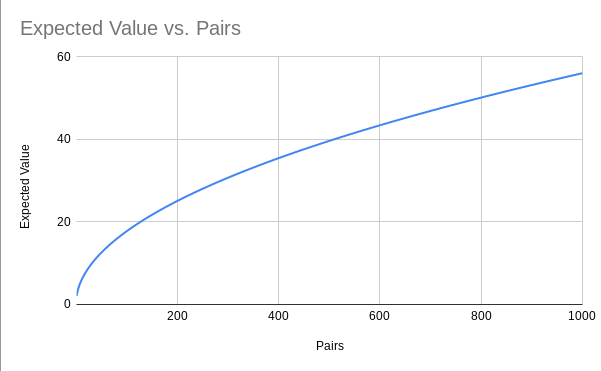

# sock-matching

## Problem
The problem comes from [The Riddler](https://fivethirtyeight.com/features/can-you-find-a-matching-pair-of-socks/).
The goal is to find the expected number of socks you need to pick at random to get a pair. The problem starts with 10 pairs.

I was able to find a formula for the expected number of picks with N pairs of socks. I wrote the JavaScript program embedded into [sock-matching.html](sock-matching.html), source in [sock-matching.js](sock-matching.js).

The program can produces two different outputs. The first is a comparison between theoretical resutls and a simulation. The results are in [expected-value-theoretical-vs-simulated.csv](expected-value-theoretical-vs-simulated.csv). The second output is the theoretical expected values for 2 to 1000 pairs of socks. These results are in [expected-values-vs-pairs.csv](expected-values-vs-pairs.csv).

Here is a graph of the expected values vs. pairs.

